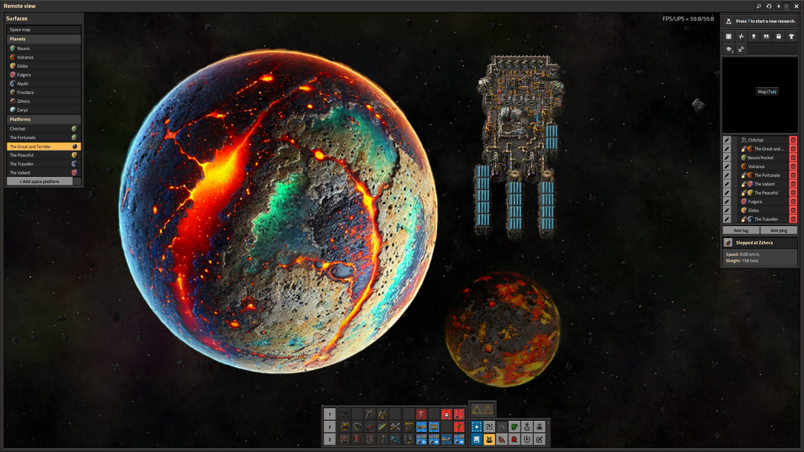

A small mod for [Factorio: Space Age](https://factorio.com/) to enhance the mod [Visible Planets in Space](https://mods.factorio.com/mod/visible-planets) by adjusting the scale of individual planets based on their gravity.

Automatically works for modded planets and mods that adjust the gravity of any given planet but doesn't override the scaling set by other mods in case a planet mod configured its own scaling. If Nauvis' gravity is adjusted, its scale will still be 1 which means other planets will shrink or grow relative to it.
This mod's scale is an additional multiplier independent of Visible Planets' "Planet final scale" map setting. In other words, adjusting the setting scales all planets while keeping this mod's individual adjustments.

As of version 1.4 this mod also adjusts the rotation speed of the planet based on their day/night cycle durations. Nauvis' day/night cylce is used as reference and its rotation speed matches your game's Visible Planets Rotation Speed setting, every other body is scaled relative to this. If you don't like this behavior you can turn it off by turning off the `Day/Night Cyle rotation speed adjustment` startup setting.

# Relative scale

Here's an overview of the relative scale of the different planets:

| Planet   | Gravity | Scale  | Rotation multiplier |
| -------- | ------- | ------ | ------------------- |
| Nauvis   | 10      | 1      | 1                   |
| Vulcanus | 40      | 1.587  | 4.667               |
| Gleba    | 20      | 1.259  | 0.7                 |
| Fulgora  | 8       | 0.928  | 2.333               |
| Aquilo   | 15      | 1.144  | 0.35                |
| Cerys*   | 0.15    | 0.215  | 1.167               |

\* Example for modded planets. [Cerys](https://mods.factorio.com/mod/Cerys-Moon-of-Fulgora) is a modded moon of Fulgora and, as expected, is rendered much smaller than the full sized planets.

# Moons
Visible Planets also renders nearby bodies, such as moons when you're orbiting their parent planet or vice versa when you are orbiting the moon. Visible Planets Scale applies the same gravity-based scaling logic to these bodies, so their apparent size stays consistent with the rest of the system.

Orbiting [Zzhora](https://mods.factorio.com/mod/planet-zzhora) with Vulcanus in the background. The mod [Better Planets](https://mods.factorio.com/mod/Better-Planets) sets Zzhora as a moon of Vulcanus.

# Realism

As mentioned in [one of the discussion pages](https://mods.factorio.com/mod/vp-scale/discussion/67707729f934f2a791830ebd) this mod isn't really realisitc. From a fuel efficiency point of view, space platforms usually want to be as close to the planet as possible which means from the point of the view of the platform the planet would fill up your entire field of view. However if you'd like some visual cue for the size of the planet, or just some more distinction between the planets, this is the mod for you!

# Calculation

Each planet has a gravity property defined in the game files. We can use this as a proxy for size: Nauvis has a gravity of 10, Gleba 20.
Now this doesn't mean Gleba should be twice as big; it has twice the mass, assuming the planets have roughly the same density, Gleba's volume is twice as big.

The volume of a sphere in terms of its radius is as follows: `V = 4/3πr³`
And the other way around: `r = (3V / 4π)^(1/3)`

So if we take Nauvis as the base size and define its radius as 1, filling in the first formula, we get the `V(Nauvis) = 4.19`.
Then doubling that and putting it in the second formula we get `r(Gleba) = 1.26`

So Gleba should be rendered 26% bigger than Nauvis.

# For other modders

Are you manually setting the scale yourself, or are you creating a black hole with a huge gravitational pull or a cloud formation with hardly any and you don't want your sprites to scale? Add the desired planet(s) to the blacklist by calling `vp_scale_add_planets_to_scale_blacklist({"vulcanus", "gleba"})` in your data stage. Just replace Vulcanus and Gleba with your own `PlanetPrototype.name` names.